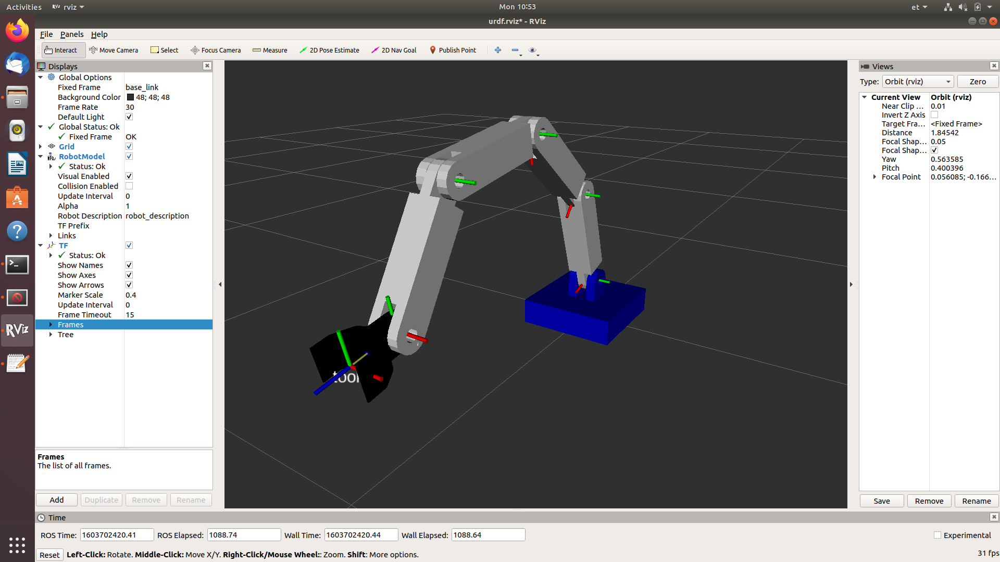

# aironbot_description

## To use the package add it into your catkin_ws/src folder and install following

*sudo apt install ros-<your_ros_version>-urdf-tutorial*

*sudo apt install ros-<your_ros_version>-state-publisher-gui*

## To run the model navigate into:
 
*catkin_ws/src/aironbot/urdf*

And run command:

*roslaunch urdf_tutorial display.launch model:= aironbot.urdf*

## Screenshot in working condition

